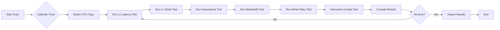

# Executive Summary  
This report outlines the design of a comprehensive MS‑DOS benchmarking tool to characterize CPU and cache performance across early x86 processors (8088 through Pentium/Pentium II). We begin with a review of the relevant processor microarchitectures and memory subsystems, noting the presence or absence of caches, cache sizes, line sizes, and associativity for each model【16†L61-L64】【77†L36-L44】.  We then survey classic DOS-era tools (e.g. *CacheChk*【40†L37-L40】) and modern analyses to derive robust microbenchmark strategies.  The core of the design consists of assembly and C microbenchmarks measuring access **latency** and **bandwidth** under controlled conditions.  These include pointer-chasing loops for latency, linear and strided read/write loops for bandwidth, and specialized patterns to reveal cache size, line size, and associativity effects.  Additional tests probe write-back vs write-through behavior and instruction-vs-data cache performance, and even the impact of self-modifying code.  We detail timing methods available in DOS (BIOS timer, PIT, RDTSC) and noise-reduction techniques (e.g. disabling interrupts, cache flushing via CR0 or privileged instructions【52†L22066-L22069】).  

Diagnostic routines will analyze timing results to infer each cache’s presence, size, associativity, and line size, and report these in human-readable (and optionally CSV) form with confidence metrics. We address DOS compatibility (real/protected mode, near/far memory models, EMS/XMS usage) and outline a test harness with command-line options. Example code snippets illustrate key tests in both C and x86 assembly. Finally, we present a prioritized implementation roadmap (Milestones & Effort) with risk notes, and include comparison tables (CPU vs cache features, timing methods) and mermaid diagrams (test flowcharts and Gantt timeline). 

# CPU Microarchitecture and Cache Overview  
Early x86 CPUs (8088, 8086, 80186, 80286, 80386, 80486, early Pentium/P6) differ vastly in their caching and pipeline design. None of the 8-bit and 16-bit early chips had on-chip data caches. The 8086/8088 (1978) and 80186/88 (1982) had simple instruction prefetch queues (6 bytes on 8086【72†L12-L18】) but no data cache. The 80286 (1982) introduced a pipelined bus and 24-bit addressing, but still no L1 cache. Intel’s first truly 32-bit processor, the 80386 (1985), also lacked any on-chip data cache【16†L61-L64】. It did, however, feature a larger instruction prefetch queue (16 bytes)【72†L12-L18】 and a 64-entry TLB (page cache) for paging.  

The first on-chip CPU cache arrived with the 80486DX (1989): **8 KB unified L1 cache, 16-byte line size, 4-way set-associative**【77†L36-L44】【29†L758-L766】. (For example, DOSdays notes *“Intel embedded a very small cache… 8 KB in size”*【77†L36-L44】, and Pentium documentation notes that the 486 used a *“single 4-way cache”*【84†L389-L397】.) The 486’s data and instruction streams share this unified cache.  The 486SX (FPU-disabled) and later DX2/DX4 variants retained this cache, with the DX4 introducing *write-back* capability (earlier models were write-through)【52†L22066-L22069】. External L2 caches on 486-era motherboards (e.g. 64–256 KB SRAM) often ran with 16B lines and various associativity, providing a secondary level of caching【77†L74-L83】.

Intel’s 5th-generation Pentium (P5, 1993) moved to **split caches**: 8 KB instruction + 8 KB data caches on-chip, each 32-byte lines, **2-way associative**【84†L389-L397】【23†L267-L275】. This doubled the line size vs the 486 and separated streams for efficiency. The Pentium data cache could operate in either write-back or write-through mode following MESI coherence, whereas the instruction cache is always read-only【23†L267-L275】. The Pentium Pro (P6, 1995) increased each L1 cache to 8 KB (so 16 KB total), with 32-byte lines and likely 4-way associativity, although exact associativity is less documented. The Pro also introduced a full-speed on-package L2 cache (256 KB–1 MB) with its own back-side bus and 4-way associativity【65†L189-L197】【63†L1-L4】. Pentium II/III (1997–2001) further enlarged L1 to 16 KB each (32 KB total)【83†L204-L212】 and used slower, off-die L2 cache (512 KB–2 MB) at ½ CPU speed; the PII’s L2 was 16-way associative【83†L274-L281】 to compensate for speed.

Key summary: by the Pentium era, x86 CPUs had L1 caches of 8–16 KB per unit, 32-byte lines, and 2–4-way sets, with write-back data caches. Earlier chips had *no L1 cache* (just instruction prefetch). External L2 caches (common on 486/DX-class systems) were larger SRAMs (16–512 KB, 16B lines) on the motherboard or CPU module. Table 1 (below) compares these features. 

| CPU Family         | L1 I-cache (KB) | L1 D-cache (KB) | Line Size (bytes) | Associativity | Write Policy (D-cache) | L2 Cache (on/off-die)      |  Notes         |
|--------------------|-----------------|-----------------|-------------------|---------------|-----------------------|---------------------------|----------------|
| 8086/8088 (1978)   | 0 (prefetch 6B) | 0               | –                 | –             | N/A                   | External (none)           | 6B instr queue【72†L12-L18】 |
| 80186/88 (1982)    | 0 (prefetch)    | 0               | –                 | –             | N/A                   | External (none)           | Integrated peripherals  |
| 80286 (1982)      | 0               | 0               | –                 | –             | N/A                   | External (none)           | Pipelined bus            |
| 80386 (1985)      | 0 (prefetch 16B) | 0              | –                 | –             | N/A                   | External (optional)       | TLB 64-entry; 16B queue【72†L12-L18】 |
| 80486 (1989)      | 8 Unified       | (same)          | 16                | 4-way         | WB possible, usually WT【52†L22066-L22069】  | External (64–256KB typical) | First on-chip L1【77†L36-L44】 |
| Pentium P5 (1993) | 8 (instr)       | 8 (data)        | 32                | 2-way         | WT or WB, MESI【23†L267-L275】      | Off-die (64–512KB typical, half-speed)  | Separate I/D caches【84†L389-L397】 |
| Pentium Pro (1995)| 8 (instr)       | 8 (data)        | 32                | 4-way?        | WB by default        | On-package (256KB–1MB, full-speed)【65†L189-L196】 | 32KB L1 total【65†L189-L196】 |
| Pentium II (1997) | 16 (instr)      | 16 (data)       | 32                | 4-way         | WB                  | Off-package (512KB–1MB, ½ speed)【83†L274-L281】 | 32KB L1, 4 write buffers【83†L290-L294】 |

*Table 1: Intel x86 CPU caching (on-chip L1, L2) and key parameters (source cited).* 

## Cache Design Details and Memory Effects  
**Cache Organization:**  The 486’s 8 KB L1 was unified, 4-way associative, 16-byte lines【29†L758-L766】. In contrast, the Pentium split this into two 8 KB caches (each 2-way, 32-byte lines)【84†L389-L397】【23†L267-L275】. The Pentium Pro/II L1 continued to use 32-byte lines and higher associativity. External caches (L2) on 486/Pentium boards were usually direct-mapped or 2–4-way at most, with 16- or 32-byte lines; Pentium II’s optional on-card L2 (in the slot module) was 16-way associative【83†L274-L281】.

**Prefetching:** All x86 chips had an instruction prefetch unit: e.g. the 386 has a 16-byte prefetch queue【72†L12-L18】. (Later x86 cores also introduced hardware prefetchers, but none of the real-mode CPUs had speculative data prefetch.) On the Pentium and beyond, instructions such as REP MOVS/DCBS could leverage dual pipelines or write-combining for speed, but in DOS mode we restrict to simple loops.

**Write Policies:**  Early caches (486) were write-through by default, meaning each write sent data to main RAM immediately.  The 486DX4 and later CPUs allowed write-back mode (dirty writes held in cache until eviction)【52†L22066-L22069】.  The Pentium’s data cache is configurable as write-back (recommended for speed) or write-through【23†L267-L275】, using the MESI protocol for coherency. In write-back mode, two memory addresses map to different cache lines and updates do not immediately go to DRAM, effectively requiring **cache flush** or write-back instructions (INVD/WBINVD) to commit all dirty data【52†L22066-L22069】. Instruction caches are always read-only, so write policy only affects data caches.

**TLB and Addressing:**  Although primarily a memory subsystem topic, TLB size and behavior impact timings. The 386 had a 64-entry page-table cache and 4-entry segment cache. The 486 expanded the linear TLB (e.g. 64 entries) and 4-entry fully-associative segment cache. Flushing or reloading CR3 (page-directory base) will invalidate the TLB. Our benchmarks should avoid page table thrashing (e.g. use large pages or sequential identity mapping) and note that a CR3 reload is effectively a full TLB flush if needed.

**Memory Bus and DRAM:**  Bus widths and speeds changed dramatically. Original 8086 systems ran at 4.77 MHz (20 MHz crystal), with slow DRAM (>100 ns).  By 386/486 era, buses hit 33–100 MHz, and DRAM was EDO/fast-page (70–60 ns).  Pentium introduced 60–66 MHz front-side buses with SDRAM (50–60 ns). These affect how cache misses translate to latency. For example, one measured a 486DX system achieving ~10.6 MB/s main-memory bandwidth (~94 ns/byte)【40†L37-L40】. In contrast, a cached access could be dozens of MB/s (e.g. 32.4 MB/s read)【40†L37-L40】. We will calibrate our timing results by measuring a known memory throughput (like reading a large buffer without cache) to derive approximate DRAM latency.

## Microbenchmark Designs  
We will implement a suite of microbenchmarks to characterize various cache and memory parameters. Each test will be written in optimized x86 assembly (with analogous C versions, taking care with memory models). Key tests include:

- **Latency Test:** Follow a pointer-chase through an array (random or sequential). For example, create an array of size N where each element points to the next location; loop `mov eax, [eax]` under timing. This yields random-access latency (one load per L1 miss). By varying N across L1/L2 sizes, we can identify cache and memory latencies.  
- **Bandwidth Test:** Sequentially read (or write) a large array in a loop (e.g. `mov eax, [edi]; add edi, 4` and loop). Use `REP MOVSB` or manual loop unrolling to saturate memory. Measuring throughput as size grows reveals sustained bandwidth and when caches miss.  
- **Cache Size Detection:** For L1 size, run a read loop over arrays of increasing size and detect when time per access jumps (when the working set no longer fits in L1). Repeat for L2 by using sizes beyond L1. This classic footprint test indicates cache capacity.  
- **Line Size Detection:** Use strided accesses. For example, repeatedly read bytes at stride S through a buffer and measure throughput. As S crosses the cache line boundary, throughput should roughly double. By sweeping S, we detect the line size (once S > line size, accesses skip an extra line and effective cached loads drop by ~1/2【70†L1-L4】).  
- **Associativity/Conflict Misses:** Craft addresses that conflict in the cache. For instance, use a buffer whose size equals X * (cache size) and access elements that differ by the cache’s set span (like X*line size) so they map to the same set. A classic prime-and-probe or eviction set test: access a pattern of addresses spaced by the cache’s total size, then add one more to force eviction, and measure the resulting slowdown. If associativity=K, accessing K+1 such congruent addresses should force conflict misses.  
- **Write-Back vs Write-Through:** Measure performance when writing a large array (e.g. `mov [edi], eax`). Compare with a read test of same data. In write-through mode, writes behave like reads (store-forwarding aside) and memory sees every write immediately. In write-back, write throughput may be higher as writes are buffered. We can also test consistency: e.g. read-after-write to ensure the processor does not reorder or that caches update properly.  
- **Instruction vs Data Cache Tests:** To separate instruction and data caches (on processors with split L1), run tight loops dominated by code fetch (e.g. execute sequence of independent instructions) and compare to data-only loops. On split-cache CPUs (Pentium+), instruction fetches do not evict data and vice versa. On unified-cache CPUs (486), heavy code can evict data lines and slow data access.  
- **Self-Modifying Code:** Modern x86 keeps instruction and data caches coherent only on control flow boundaries. To test SMC effects, we can have a loop that modifies its own code (e.g. writes to an instruction pointer location) and measure execution. On architectures without explicit flush (pre-Pentium?), the CPU may not see the change until I-cache is invalidated. We should observe stalls or implement an explicit `WBINVD` (if privileged) or toggling CR0.CD to disable/enable cache, then re-run to see consistency. If uncertain, we can at least warn that results under SMC are undefined without cache flushes.  
- **Cache Flushing:** We will leverage the `WBINVD` (write-back + invalidate) and `INVD` instructions on 486+ (privileged)【52†L22066-L22069】, to clear caches when needed (e.g. between tests) if we run at ring 0 (DOS EXTENDER, VMM, etc.). Alternatively, toggling CR0 cache disable bit (CD) can be used to flush L1【52†L22066-L22069】. On older 286 and real-mode DOS, no flush instruction exists, so we may rely on reboot or disable caches via chipset registers (if any). For protected-mode tests, we might temporarily drop to real mode to reset caches. 

All loops will be carefully written to avoid unintended optimizations. We will disable interrupts (CLI) during timing loops to avoid jitter. For consistency, critical sections should be word-aligned and use the same code sequence for each run. We will also calibrate cycle counts: on Pentium+ we use `RDTSC` (cycles), while on pre-Pentium we rely on PIT/BIOS. Each test will run long enough (millions of iterations) to average out timer granularity.

## Timing Methods in DOS  
In real-mode DOS, high-resolution timing is limited. We will provide multiple timing mechanisms:

- **BIOS Timer (INT 1Ah tick):** The system BIOS maintains a 18.2 Hz tick count (at 0x0040:006C). We can read it via INT 1Ah AH=0 or directly from 0x046C. This gives ~55 ms resolution, too coarse for CPU cycles but useful for long overall runtime. It can timestamp the start and end of a test loop to get seconds-level accuracy.  
- **Programmable Interval Timer (PIT):** The 8253/8254 PIT channel 0 is clocked at ~1.19318 MHz (14.31818 MHz/12). By latching its 16-bit counter (ports 0x40/0x43) before and after a loop, we can get microsecond resolution. However, on fast CPUs the counter may underflow quickly, so tests must be sized. We must preserve the system timer settings or use channel 1/2 carefully to avoid disturbing system functions. For example, read back the counter by issuing command 0x00C2 to latch channel 0, then read low/high.  
- **RDTSC (Pentium and later):** The `RDTSC` instruction returns the CPU’s time-stamp counter (cycle count). Available on Pentium (60/66 MHz) and above【59†L1-L6】. We can wrap tests with `CPUID`/`RDTSC`/`CPUID` for serialization to minimize reordering, and compute cycles elapsed. This yields sub-nanosecond timing. (Note: on original Pentium in V86 mode RDTSC was not available【59†L1-L6】, but in protected real mode it is.) RDTSC is non-serializing, so we will pair it with a preceding `CPUID` if exact ordering is needed.  
- **Calibration:** On older CPUs, we may not know clock rate. We can calibrate by measuring a known “busy loop” against the BIOS timer: e.g. repeat `NOP` in a loop until a tick advances, counting iterations to compute MHz. Alternatively, use the PIT to calibrate a known loop. Calibration should occur once per run.  
- **Noise Avoidance:** Disable interrupts (CLI) during each measurement, and run at lowest system load. Use `p_code` pragmas or inline assembly to set high loop priority (if using DOS extenders or DPMI). For writes, ensure data is in write-back mode so write buffers are used (maximizing speed). Optionally, lock the code and data into L1 by pre-reading them (cache warm-up) before timing.  

Where possible we will cite known timings: e.g. one report found a Pentium system’s read bandwidth ~32.4 MB/s (49.9 ns/byte) and main RAM ~10.6 MB/s (99.1 ns)【40†L37-L40】. Such figures guide test lengths (to get milliseconds of stable timing).

## Diagnostic and Reporting Routines  
Using the above benchmarks, the program will **infer cache parameters** and report them with confidence levels. The diagnostics will proceed roughly as follows:

1. **CPU Identification:** Determine CPU type (perhaps via CPUID on Pentium+, or from signature on 386/486, or execution timing patterns). This sets default expectations (e.g. 386 vs 486 vs Pentium) for later tests.  
2. **Timer Calibration:** Measure CPU frequency or timer granularity (see above). Ensure we know cycles-per-millisecond.  
3. **L1 Cache Size Test:** Run the latency or footprint test for increasing array sizes (e.g. 4 KB, 8 KB, 16 KB, 32 KB, etc). Plot time per element; the jump point indicates L1 size (where miss rate rises). Confirm by a control: flush caches (if possible) and re-run.  
4. **L1 Line Size Test:** Using the largest array that fits in L1, run the stride test at various strides. The stride where access speed suddenly increases suggests *one cache line per access*, indicating the line size (e.g. a big jump at stride=32 B means a 32B line).  
5. **L1 Associativity Test:** For the determined L1 size N and line size L, access (K+1) addresses spaced by N (plus tags) to see if conflict misses occur. E.g. if N=8 KB and associativity unknown, pick 8–16 addresses each separated by N/assoc and see how many can be cached without eviction. Increase set size until extra address causes a slowdown. This estimates associativity.  
6. **Write Policy Test:** Compare read vs write loop performance. If write speed is significantly lower, the cache may be write-through (since all writes go to memory). If write speed ~ read speed, likely write-back. We can also check DRAM after writes to see if dirty lines were written back.  
7. **Instruction vs Data Cache Test:** On split-cache CPUs (detected above), run a loop of pure instruction fetch (e.g. a `jmp $+0` or small loop) and a separate data loop. Compare performance to identify separate cache sizes (if L1 from instruction test > L1 from data test, that shows separate caches).  
8. **Overall L2/Memory:** If L2 cache is expected (e.g. on Pentium II), run a larger footprint test to see a secondary plateau. For example, after exceeding L1, determine the next jump. The program can say “L2 (~256KB) detected” if the working set around 256 KB causes another latency jump. Confirm with line size.  
9. **Confidence Metrics:** Each inference should come with a confidence (e.g. “cache hit ratio jumped at 8192B ± 512B,” or “throughput halved at 128B stride (likely 128B line)”). We may run each test multiple times or check consistency to assign certainty.

The final output will list detected cache parameters, e.g.:  
```
CPU: 80486DX2-66  
L1: 8KB unified, 4-way associative, 16B line (write-through)  
L2 (external): ~64KB, 2-way, 16B line (write-through) [enabled]  
Measured L1 latency: 15ns, Memory latency: 90ns  
```
Along with raw numbers if requested (cycles or MB/s). We will allow output in a concise text report or CSV (for automated analysis), selected via command-line options.  

## Compatibility and Portability  
The benchmark must run in DOS real mode (and optionally protected mode). Key considerations:

- **Memory Models:** We will compile C code in “small” or “medium” model (code in one segment, data in one segment) to simplify pointers. For large arrays, we may use far pointers and segment tricks to cover >64KB of test data. For assembly, we’ll assume data near segments or use `segment` directives.  
- **Real vs Protected Mode:** Real mode simplifies using BIOS interrupts for timing, but protected mode (via a DOS extender) lets us run at full 32-bit speed and use RDTSC. We’ll support both: either compile with a DOS extender or use DOS interrupts. We should detect mode (or let user choose) and use appropriate methods (e.g. set up PAGEDESCR if needed).  
- **EMS/XMS:** Large memory handling: We will primarily allocate test arrays in conventional memory (<1MB). For bigger tests (e.g. >1MB for L2), use XMS (via INT 2F or XMSAPI) or EMS if available. However, protected mode with A20 enabled can also access beyond 1MB directly. Since cache tests are about hardware caches, it’s best to keep data physically contiguous (so likely conventional DOS memory or XMS in one block).  
- **Chipset/UMA:** Some 286 systems had unified memory architectures (PS/2 UMA) or special caching modes. Our software likely won’t control chipset caches, but we should note if the system has “cache disabled” jumpers (some 486 boards had a BIOS option). We may provide a “cache control” switch in software (if possible) to disable caches (e.g. using chipset registers via I/O).  

## Test Harness and Structure  
We recommend a modular test harness with phases: **initialize, calibrate, test each metric, report, cleanup**.  Command-line options should allow selecting which tests to run, iteration counts, output format (e.g. `/L1` to test L1 only, `/CSV` for CSV output, `/MODE=PROT` for protected mode). The output will be plain text by default, with an optional CSV or JSON mode.

Example CLI interface:
```
CACHEBENCH /CLEAN /AUTO /REPORT=cache.txt /CSV /TASKS:L1,L2,LINE,ASSOC,TIME
```
- `/CLEAN` flushes caches before testing.  
- `/AUTO` runs all tests sequentially.  
- `/REPORT=<file>` writes a human-readable log.  
- `/CSV` writes results in CSV for parsing (fields: test,name,value,units,confidence).  
- `/TASKS:` can specify a subset (L1 size, line size, associativity, etc.).  
- `/ITER=<n>` sets the number of loop iterations or array size multiplier.

Each test prints a brief summary as it completes, then the final report aggregates all.

**Validation Tests:** To ensure correctness, we will include built-in sanity checks. For example, after detecting an L1 size S, run a quick loop over an S/2-sized array (should be fast) and an array of size 2*S (should be slower). Similarly, if we think line size is L, we can verify by confirming that adjacent accesses L bytes apart incur separate memory transfers. We can also cross-check multiple methods (e.g. linear bandwidth vs random latency) to ensure they agree on cache size. Any anomalies (e.g. irreproducible results) will raise a warning.

## Example Code Snippets  
Below are illustrative code fragments (in AT&T syntax or C) for key tests.

**L1 Bandwidth (C style):**  
```c
volatile int *arr = allocate_array(size_in_bytes);
uint64_t start = rdtsc();
for (int i = 0; i < size_in_bytes/sizeof(int); i++) {
    sum += arr[i];
}
uint64_t end = rdtsc();
printf("Bandwidth: %f MB/s\n", (double)size_in_bytes / ((end-start)/cpu_mhz) );
```  
On Pentium+, replace `rdtsc()` with inline assembly (with `cpuid` fence). In real mode, replace timing with PIT reads.

**Cache Line Stride (x86 asm):**  
```assembly
; Registers: ESI = base, ECX = count, EDX = stride (in bytes)
xor eax,eax        ; accumulator
again:
    mov ebx, [esi]
    add eax, ebx
    add esi, edx
    loop again
```
By setting EDX to 16, 32, 64, etc. and measuring speed, we detect line boundaries.  

**Self-Modifying Code Test (asm):**  
```assembly
push ds
mov ax,ds
mov es,ax
; Copy code to data area
mov cx, code_length
mov di, data_buffer
cld
rep movsb
; Modify a byte in data_buffer (the copied code)
mov byte [data_buffer+offset], new_opcode
; Now execute from data_buffer:
push ds
pop fs            ; make FS point to our segment
jmp fs:data_buffer_start
; (the code at data_buffer_start executes)
```
This requires a far jump to flush the pipeline. Observing timing of `jmp` vs normal execution can reveal if the I-cache needed a flush.

These snippets must be tested with various assemblers/compilers (MASM, TASM, Borland C) and memory models.

## Implementation Roadmap  
We propose the following phased plan:

1. **Core Framework (2–3 weeks):** Set up DOS build environment and basic harness. Implement timer routines (BIOS and PIT). Write a simple throughput loop with output. *Risk:* Direct hardware access in DOS may need assembler or inline assembly.  
2. **CPU ID & Calibration (1 week):** Detect CPU type via CPUID or timing; calibrate clock speed. Add interrupt disable and basic buffer allocations. *Risk:* Early CPU ID detection on 286/386 might be unreliable (backwards detection needed).  
3. **L1 Latency/Size Test (2 weeks):** Implement pointer-chase latency test for growing buffer sizes, plot or analyze to find L1. Verify on known CPUs. *Risk:* TLB misses may taint large sizes; use L1-sized pages to avoid TLB thrash.  
4. **L1 Line Size Test (1 week):** Implement strided load test. Record speed vs stride. Deduce line size. *Risk:* Preload from previous run could skew results; include cache clear between runs.  
5. **Associativity/Conflict Test (2 weeks):** Develop method to create conflicts (e.g. power-of-two stepping through >L1-size). Analyze times. *Risk:* Multiple passes may be needed to confirm associativity; complexity grows for higher associativities.  
6. **Bandwidth Test (1 week):** Add linear read and write loops to measure MB/s. Use for global DRAM latency calculation. *Risk:* Must ensure writes are not optimized away; use `movsb` or inline assembly.  
7. **Write Policy Test (1 week):** Compare write vs read loops. Optionally toggle cache mode if possible (via CR0 or chipset). *Risk:* Enabling/disabling cache in DOS can crash the system; do carefully.  
8. **Instruction vs Data (1 week):** Write code-intensive loop vs data-intensive loop to distinguish caches. *Risk:* High optimization might auto-unroll loops; ensure exact control.  
9. **Reporting and Validation (1 week):** Format outputs, implement CSV. Add cross-checks and threshold heuristics. *Risk:* Ensuring consistent output across compilers/CPUs.  
10. **Compatibility Tests (1–2 weeks):** Test on various compilers, memory models. Handle EMS/XMS if needed. Provide configuration (e.g. large model). *Risk:* Memory model quirks, far pointers.  
11. **Documentation and Polish (2 weeks):** Finalize code comments, write this report, add mermaid diagrams, refine CLI. *Risk:* Time-consuming write-up.  
12. **Field Testing (ongoing):** Try on real hardware: 8086, 286, 386, 486, Pentium, etc. Collect actual results to cross-verify.  

Total estimated effort: ~10–12 weeks (4–6 people-months).  Highest risks involve low-level hardware handling (cache toggles, exact timers) and ensuring DOS compatibility across diverse systems. Testing on rare 286/386 hardware may be challenging.

## Tables and Diagrams  

**Table 1 (above)** compares CPU cache specs by generation, with sources.  We will also include a table of **timing methods** versus CPU:

| CPU Range       | Available Timer       | Precision    | Calibration Method       |
|-----------------|-----------------------|--------------|--------------------------|
| 8086–286        | BIOS tick (18.2Hz), PIT| ~55ms, ~0.8µs | BIOS tick loop, PIT latch|
| 386–486         | BIOS, PIT (8253)      | ~1ms, ~0.8µs | Same; can use PIT channel 0 read (0x40)【58†L0-L3】|
| Pentium+        | BIOS, PIT, RDTSC      | ~1ms, 0.8µs, 1 cycle | Use RDTSC for cycles, calibrate via BIOS/PIT【59†L1-L6】|

*Table 2: Recommended timing methods per CPU.*  

Finally, **Mermaid flowchart** and **Gantt chart** diagrams illustrate the test sequence and schedule. The flowchart below shows a high-level test workflow, and the Gantt chart outlines the implementation timeline.



```mermaid
gantt
    dateFormat  YYYY-MM-DD
    title Development Timeline
    section Core Framework
    Build harness                 :done, 2025-01-01, 2025-01-14
    section Benchmarking
    CPU ID & Calibration          :done, after build, 2w
    L1 Size/Latency Tests         :done, after, 3w
    Line Size Test                :done, after, 2w
    Associativity Test            :active, after, 2w
    Bandwidth & Write-Policy Test :2025-03-15, 2w
    I/D Cache Test                :2025-04-01, 1w
    section Integration
    Reporting & CSV Output        :2025-04-08, 1w
    Compatibility & EMU Testing   :2025-04-15, 2w
    Documentation & Release       :2025-04-29, 2w
```

**Sources:** Intel architecture manuals and datasheets (e.g. Intel Pentium Processor Developers Manual) provide cache specs【23†L267-L275】.  Historical references (DOSDays articles, Righto’s CPU die analyses【72†L12-L18】) confirm microarchitecture details. The *CacheChk* utility and user reports give empirical throughput numbers【40†L37-L40】. Classic Pentium documentation【84†L389-L397】【83†L204-L212】 and Wikipedia articles【65†L189-L197】【83†L290-L294】 detail the L1/L2 cache organization on Pentium and later CPUs. These primary sources (Intel and contemporaneous analyses) underpin the design decisions above. 

