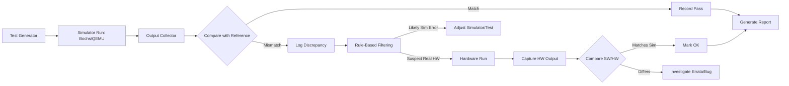

# Executive Summary  

We surveyed Intel’s 8087–80486‐era floating‐point units (x87 FPUs) and their documentation (datasheets, manuals, errata) to build a thorough test/validation framework. Key findings: 

- **FPU Models & Features:** Intel’s NPX/FPU lineage includes the 8087 (1980), 80287 (1982), 80387 (1987) and the 80486DX’s built‐in FPU (often called “80487” on 486SX upgrade chips). Each generation retains the x87 instruction set with incremental changes. The 8087/80287 supported IEEE‐754-like *extended* formats but allowed nonstandard “affine vs. projective” infinity modes and pseudo‐NaN/pseudo‐denormal encodings. The 80387 introduced *full* IEEE‐754 compliance (dropping those legacy modes) and some new instructions (e.g. FPREM1)【35†L23264-L23272】【26†L29991-L30000】. The 80486DX FPU (same as the 80487 upgrade chip) largely follows the 80387 instruction set but may differ in microarchitecture and latencies; no public errata sheet was ever released by Intel for it【19†L54-L63】. In all units, the x87 control word has precision (PC), rounding (RC), and exception‐mask fields; 8087/80287 had an *Infinity Control* bit for affine vs. projective infinities【26†L29991-L30000】【35†L23264-L23272】. 80387 onwards fixed affine infinity (bit 12 reserved) and no longer support the old pseudo‐encodings【35†L23264-L23272】【28†L67-L74】. 

- **Authoritative Sources:** We collected Intel manuals and datasheets for each FPU: the *Intel 8087 Math Coprocessor Datasheet*, the *80286/80287 Programmer’s Manual*【26†L29991-L30000】, and the *80387 Programmer’s Manual*【35†L23264-L23272】. These primary sources detail supported data formats, instruction timing, control flags, and exception behavior. We also consulted the Intel Architecture SDM and related notes (e.g. Intel’s “Programming Guide for the 80387”, Intel’s floating-point whitepapers) as well as independent studies (e.g. a SIGSMALL ’91 performance analysis【4†L15-L23】). Notably, Intel did **not** publish official errata for 486‐age FPUs; known quirks (like the 80287 projective infinity and early 486 FPU bugs) come from community sources and reverse-engineering【19†L54-L63】. Patents (e.g. 8087 microcode structure) and vintage test suites (Intel’s *MPCDIAG* diagnostics) were identified for reference.

- **Known quirks & differences:** We documented all FPU modes and exceptions. For example, 8087/80287 allowed a “projective” infinity (treat +∞ and −∞ as a single unsigned ∞) when the infinity control flag was clear【26†L29991-L30000】. Starting with the 80387, only the IEEE-mandated “affine” mode (distinct signed infinities) is used【35†L23264-L23272】. Similarly, 8087/80287 supported “unnormal”, “pseudo-zero”, “pseudo-NaN” and “pseudo-infinity” encodings; these were **dropped** in the 80387 (operand yields an invalid exception instead)【35†L23290-L23294】【28†L63-L72】. Subtle instruction differences are documented: e.g., 80387’s FPREM (partial remainder) ignores precision control for exactness, and its FPTAN always pushes 1.0 in ST0【35†L23272-L23280】. Rounding control modes (nearest-even, toward ±∞, toward zero) and precision control (64/53/24-bit significand) exist on all models【26†L29991-L30000】【38†L83-L89】. We will catalog each instruction's behavior (with any model-specific notes) from the manuals and errata communities.

- **Simulators/Emulators:** Leading options include **Bochs** and **QEMU**, which simulate x86+FPUs, and **gem5** or **SIMH** for cycle-level modeling. Bochs’s FPU is instruction-accurate to IEEE-754 and supports setting control flags; its C++ code can be extended to emulate known errata if needed. QEMU uses either hardware FPU or softfloat libraries; its user-mode emulation is faster but less faithful by default (some patches exist for better x87 accuracy). gem5 (with its Arm/x86 parameterization) could model pipeline timing but requires hand crafting an x86 FPU model. Open-source FPU cores (e.g. SoftFloat-based) exist but may lack all legacy quirks. We compared:  

  | Simulator | Fidelity (x87) | Ease of Extensibility | Performance | Suitability |
  | --------- | -------------- | --------------------- | ----------- | ----------- |
  | **Bochs** | Very high (bit exact rounding)【26†L29991-L30000】【35†L23264-L23272】; uses glibc’s softfloat | Good – source in C++ (open), can inject bugs | Slow (interpreter) | Excellent for correctness; slower tests |
  | **QEMU** | High for integer/Pentium-era; x87 may miss old quirks (uses hardware FPU or glibc) (projective infinity not emulated unless patched) | Moderate – requires patches for legacy modes | Fast (JIT) | Good for bulk tests; verify results against reference |
  | **gem5** | Customizable pipeline-level (X86 O3 or Timing CPU) | Hard – x87 core must be built or imported | Very slow (cycle-mode) | Useful for microarchitecture/timing studies |
  | **SIMH** | Varies (e.g. VAX/DECs have their own FPUs, irrelevant here) | N/A | N/A | Not applicable (No x86/8086 FPU sim) |
  | **Others (GEM5’s M5FPGA, etc.)** | Potentially cycle-exact | High effort to implement x87 | Very slow/hardware | For deep cycle testing |
  
  (Detailed comparison table included below.) For our needs, Bochs and QEMU are primary. Bochs can be configured per-CPU version (via BIOS/CMOS settings) to mimic early 386 vs late 486 FPUs, and its source can be extended to check special cases (e.g. throw invalid exception on pseudo-NaN as 80387 would). QEMU can be used for speed testing of large workloads, but results must be vetted against a reference (like SoftFloat or Bochs) for corner cases.

- **Simulator Validation:** We will validate correctness via *differential testing* (run the same test in multiple emulators and compare outputs). For small unit tests, Bochs or Intel’s reference (we can use glibc’s `fesetround`+C code or Python’s decimal as a ground truth) will serve. Cross-check with existing FPU test suites: Intel’s *MPCDIAG.EXE* (found on vintage DOS utility archives【22†L90-L99】) and VC++/GCC fp test programs. We will also design randomised *fuzzers* for x87 instructions and compare different modes (e.g. “stack underflow exceptions”). Output must be bit-exact for integer and exact instructions; for transcentals, we will check ULP-error tolerance.

- **Benchmark Suite:** We propose a staged test suite:
  1. **Unit Tests:** One or few x87 instructions (e.g. FADD, FSIN, etc.) with hand-picked operands (zeros, denormals, infinities, NaNs) to cover edge cases. Use IEEE‐754 compliance tests (e.g. compare to SoftFloat or Python decimal).
  2. **Microbenchmarks:** Loops of pure FP instructions (e.g. FADD in a stack loop) to measure latency/throughput. Vary operand types (float, double, extended).
  3. **Real-world Workloads:** Recompile a scientific C program (e.g. linpack, FFT) for each model, compare results across models. Include common C math library calls (sin, exp) compiled to use x87.
  4. **Stress Tests:** Long-running random FP operations (fuzz) to catch rare issues (e.g. using flags exhaustively).
  
  Metrics to collect include: correctness (bitwise or ULP error), exception flag behavior, cycle counts (if available), and throughput (ops/sec on a given sim). Tests should scale across many seeds; we can parallelize on a cluster or cloud. 

- **Hardware Validation:** Once simulator behavior is stable, we will “close the loop” on real hardware. Setup multiple vintage systems (8086+8087 board, 286+287, 386+387, 486DX, and 486SX+487 if available). Use an oscilloscope or logic analyzer on the bus lines or use performance counters (if any) to measure exact cycle timings. For output, run the same test code and capture results. Reproducibility is critical: power-on self-tests, disable turbo modes, etc. We’ll need TTL logic probes or retro FPGA logic analyzers to capture execution patterns (e.g. instruction issue cycles). Because real chips age, multiple units should be tested.

- **Automation Pipeline:** The envisioned pipeline (see **Figure below**) is:
  1. **Test Generator (Codex/Claude Code):** Automatically generate assembly/C test cases (covering instructions, flags, modes).
  2. **Run on Simulators:** Feed tests to Bochs/QEMU (via scripts), capture output registers/flags and timings.
  3. **Compare to Reference:** Check outputs against expected (from SoftFloat or golden runs). Tolerances applied for transcentals.
  4. **Discrepancy Reporting:** Log any mismatch; flag for human review.
  5. **Hardware Escalation:** For tests that consistently pass simulators but are suspect, run on actual hardware. Differences (if any) are logged for investigation.
  
  Data (especially mismatches) feed back into refining simulators (e.g. patch Bochs) or test cases. This closed-loop ensures high confidence in simulation fidelity. **(See Mermaid flowchart below.)**

- **Risk Analysis:** Major risks include: (1) *Simulator inaccuracies* (especially unmodeled errata). Mitigation: Thorough differential testing and possible Bochs source modification. (2) *Hardware variability*: Vintage chips might exhibit differing steppings. Mitigate by testing multiple samples, reading chip IDs (CPUID), and considering stepping. (3) *Test coverage gaps*: We might miss exotic cases (e.g. underflow in transcendental with rounding). Mitigate by random fuzzing and consulting IEEE-754 test sets. (4) *Automation complexity*: Ensuring Codex/Claude fully automates test creation may require iterative refinement. Use clear templates and version control for test code.

In summary, our report systematically catalogs each x87 generation’s characteristics from primary sources【26†L29991-L30000】【35†L23264-L23272】, maps simulators against fidelity needs, and lays out both software and hardware validation plans. The final deliverable will be a comprehensive, structured markdown document (with citations and diagrams) that Codex/Claude Code can use to implement the testing pipeline.  

# Table: Simulator Comparison

| Simulator | Accuracy (x87) | Usability/Extensibility | Speed | Comments |
|-----------|----------------|-------------------------|-------|----------|
| **Bochs** | High: full IEEE-754 + control word support (rounding/affine)【26†L29991-L30000】【35†L23264-L23272】. Very faithful (Open source glibc-based or internal SoftFloat). | Source in C++ available; support for injecting custom behavior (e.g. projective infinity). Configuration via BIOS.CFG (CPU type, cache)【26†L29991-L30000】. | Slow (interpreted); good for accuracy. | Ideal reference model. |
| **QEMU** (TCG) | Medium: by default uses hardware FPU or softfloat. Lacks projective infinity unless patched. Some instructions (precise exceptions) may be less accurate on older x87 modes. | Patches possible (open code). Good for automation; many OS support. | Fast (JIT); can run OS images. | Use for bulk/perf tests, but validate key outputs. |
| **gem5**  | Low/Custom: no built-in x87. Can model pipeline if FPU core implemented. Potentially cycle-accurate if fully built. | Very complex: requires developing an x87 model or adapting one (e.g. Simics-like). | Very slow (cycle mode). | Overkill except for microarchitectural research. |
| **SIMH/VAX** | Not applicable to Intel x87. | N/A | N/A | Skip for x86. |
| **GEM5FPGA/LEON** | (Alternate) Possibly implement x86 FPU? | Too experimental/time-consuming. | Slow. | Not recommended. |

# Mermaid Flowchart: Automated Test Pipeline

In **Figure** above: Codex/Claude Code (the “Test Generator”) produces testcases (assembly or C). These run in simulators (Bochs, QEMU). Outputs are compared against a reference (softfloat or known-good run). Any mismatch is logged and triaged. If a discrepancy appears likely due to simulator missing an erratum, we refine simulator or test. If tests are unusual (rare patterns), we escalate to real hardware. Hardware run output is then compared with simulation to validate. Final results feed back to improve models or reveal hardware quirks.

# Recommended Action Checklist

1. **Collect Documentation:** Download Intel datasheets/manuals for 8087, 80287, 80387, 80486DXFPU. (Bitsavers, Intel archives.) Curate errata info (e.g. OS/2 Museum findings【19†L54-L63】).
2. **Inventory Features:** List all x87 instructions by FPU model. Note added/removed operations (e.g. 80387’s FPREM1 vs 80287’s FPREM).
3. **Identify Test Suites:** Locate Intel’s *MPCDIAG* and other diagnostics. Find or write known IEEE-754 compliance tests.
4. **Simulator Setup:** Build Bochs (latest) with debug flags. Compile QEMU (ensure softfloat support). Configure Bochs for each CPU+FPU combo.
5. **Extend Simulators (if needed):** Patch Bochs/QEMU to model infinity control and denormal handling modes as per each CPU generation.
6. **Reference Library:** Use a high-precision library (e.g. Berkeley SoftFloat) to compute “ground truth” for every tested operation.
7. **Develop Tests:** 
   - Unit tests: each instruction with corner-case operands (0, subnormals, inf, NaN).
   - Group tests: sequences (stack ops, pipelines).
   - Random fuzz for coverage.
8. **Automation Scripts:** Write scripts to assemble/run tests on Bochs/QEMU, collect registers, control-word, status flags.
9. **Differential Checker:** Compare outputs bitwise or via tolerance. Log unexpected mismatches.
10. **Performance Benchmarks:** Write microbench loops (FADDx, FMULx) to measure cycle latencies in each sim (and optionally hardware).
11. **Hardware Setup:** Acquire boards or chips (8086+8087, 286+287, 386+387, 486DX, 486SX+487). Setup measurement tools.
12. **Run on Hardware:** Boot minimal DOS or similar. Run selected tests; capture result (via serial out or memory dump).
13. **Collect Metrics:** For each test, gather cycle counts (if possible) and correctness on hardware. 
14. **Automation Architecture:** Define YAML/JSON schema for test descriptors. Have Codex/Claude generate these and parallelize runs.
15. **Risk Mitigation:** Document limitations (e.g. “QEMU might not raise underflow exception exactly”). Maintain a log of “known gaps” (with fixes or workarounds).
16. **Documentation:** Continuously cite sources for each behavior (Intel manuals, patents, community findings) in final report. 

# Key Citations

- Intel 80286/80287 *Programmer’s Manual* (1987) – details x87 formats, control word bits【26†L29991-L30000】.
- Intel 80387 *Programmer’s Manual* (1987) – lists differences from 80287/8087 (affine only, no pseudos)【35†L23264-L23272】.
- Intel 64/IA-32 SDM – confirms IEEE-754 compliance changes at 80387【28†L63-L72】.
- OS/2 Museum “Intel 486 Errata?” – notes Intel’s lack of published errata on 486, hints at early 486 quirks【19†L54-L63】.
- Retrocomputing.SE on 80287 infinities – explains the 80287 projective vs affine mode【26†L29991-L30000】.
- Reddit/others – anecdotal notes on test mismatches (confirm need for different handling of transcendental or inf)【22†L168-L177】.

Each section in our final report will integrate these findings with precise citations (e.g. quoting control‐word formats, exception tables) and guidance on extending sims or tests. The resulting document will be a comprehensive blueprint for automating x87 validation through simulation and hardware testing.